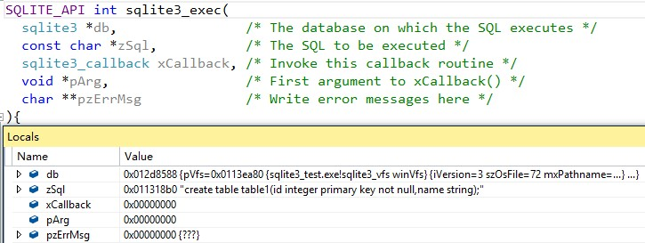

# 4.	结合SQLite执行过程详细介绍vdbe.c文件
<font face="微软雅黑" size="3px">

为了对SQLite执行过程有一个更清晰的认识，我们使用接口部分提供的API函数，编写了一段基本的数据库操作代码，在visual studio环境下，结合着八个模块的顺序进行单步调试，在sqlite3VdbeExec函  数体内，我们也看到了switch语句的传值为pOp->opcode，所以我们重点观察opcode的生成过程和VDBE核心函数sqlite3VdbeExec的执行过程，代码如下：
```
int main()
{
	sqlite3 *db = NULL;
	int result;
	result = sqlite3_open("test.db", &db);
	if (SQLITE_OK != result)
	{
		printf("Create/Open test.db error! \n");
	}
	printf("Create/Open test.db success!! \n");

	const char *sqlStr1 = "create table table2(sid integer primary key not null,age string);";
	result = sqlite3_exec(db, sqlStr1, 0, 0, 0);
	if (SQLITE_OK != result)
	{
		printf("create table table1 error! \n");
		return 0;
	}
	printf("create table table1 success! \n");
	const char* sqlStr2 = "insert into table1() values(1,'name1');";
	result = sqlite3_exec(db, sqlStr2, 0, 0, 0);
	if (SQLITE_OK != result)
	{
		printf("insert table table1 error! \n");
		return 0;
	}
	printf("insert table table1 success! \n");
	sqlite3_close(db);
	return 0;
}

```
在代码中我们可以看到几个重要的API函数的调用(sqlite3_open、sqlite3_exec、sqlite3_close)，sqlite3_exec函数执行我们输入的SQL语句，这些语句包括表的创建和表数据的增删查改，下面就是我们  的调试过程：
1. 通过在result = sqlite3_exec(db, sqlStr1, 0, 0, 0)设置断点，进入sqlite3_exec函数体内部，通过下图4-1可以看到(db, sqlStr1, 0, 0, 0)已经传入：

2. 继续执行sqlite3_exec函数，由于中间过程非常复杂我们使用下图4-2表示从sqlite3_exec开始执行到opcode生成之前的过程，也就是准备阶段：

3. 在sqlite3RunParser函数中有分词器功能函数对SQL语句进行分析，分析到SQL语句中的create命令或者表名等，就会进入sqlite3Parser函数，去解析这个命令或者语句，由于我们使用的是create table命令，所以在解析器里会执行sqlite3StartTable函数，图4-3就是sqlite3StartTable函数参数  信息：

从图中我们可以看到表名table1已经在pName1中，虚表、视图和临时表标识都为0，pParse中保存着被分析解释过的SQL语句。sqlite3StartTable函数的功能就是创建表，在函数体中通过调用sqlite3FindTable函数在main数据库中查找到这个表，然后创建了一个VDBE实例v，把OP_ReadCookie、OP_If、OP_Integer、OP_SetCookie、OP_CreateTable、OP_OpenWrite、OP_NewRowid、OP_Null、OP_Insert、OP_Close等然后执行sqlite3FinishCoding函数，并在sqlite3FinishCoding函数中创建了一个VDBE实例v，把操作符OP_Init、OP_Transaction、OP_TableLock、OP_Goto和OP_Halt添加到了v的aOp中，到此为止准备阶段结束，释放占用内存，清除各种结构，代码也从sqlite3_prepare_v2跳出。
4. 下面进入sqlite3_step函数，准备阶段处理好的VDBE实例v也被传入，而进入sqlite3Step后，就会调用VDBE处理函数sqlite3VdbeExec，这个时候v的结构如图4-4所示：

5.
进入sqlite3VdbeExec后，先进行一些变量的初始化和配置，下面进入到for循环中，pc为循环因子，初始为0。然后进入switch语句中，来执行之前生成的操作符。
