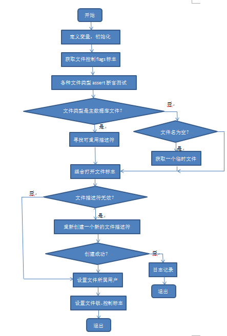

# 功能的主要实现
<font face="微软雅黑" size="3px">

该文件对于功能的实现主要是通过一系列的函数和结构体。该文件的主线函数是sqlite3\_os\_init()，初始化操作系统接口，这个程序为所有类Unix操作系统的VFS实现注册。这个程序和紧随其后的sqlite3\_os\_end()程序是本文件中对其他文件可见的唯一程序，这个程序在SQLite初始化时便会通过单线程调用。  
这个文件挂载了一些VFS（虚拟文件系统），每个VFS都包含一套系统调用的接口：  
```c
#define UNIXVFS(VFSNAME, FINDER)   3,                    /\* iVersion \*/<br>
    sizeof(unixFile),     /\* szOsFile \*/<br>
    MAX_PATHNAME,         /\* mxPathname \*/<br>
    0,                    /\* pNext \*/<br>
    VFSNAME,              /\* zName \*/<br>
    (void\*)&FINDER,       /\* pAppData \*/<br>
    unixOpen,             /\* xOpen \*/<br>
    unixDelete,           /\* xDelete \*/<br>
    unixAccess,           /\* xAccess \*/<br>
    unixFullPathname,     /\* xFullPathname \*/<br>
    unixDlOpen,           /\* xDlOpen \*/<br>
    unixDlError,          /\* xDlError \*/<br>
    unixDlSym,            /\* xDlSym \*/<br>
    unixDlClose,          /\* xDlClose \*/<br>
    unixRandomness,       /\* xRandomness \*/<br>
    unixSleep,            /\* xSleep \*/<br>
    unixCurrentTime,      /\* xCurrentTime \*/<br>
    unixGetLastError,     /\* xGetLastError \*/<br>
    unixCurrentTimeInt64, /\* xCurrentTimeInt64 \*/<br>
    unixSetSystemCall,    /\* xSetSystemCall \*/<br>
    unixGetSystemCall,    /\* xGetSystemCall \*/<br>
    unixNextSystemCall,   /\* xNextSystemCall \*/<br>
  }
```
这是一套虚拟文件系统的标准系统调用接口，为一个sqlite3_vfs对象定义了一个初始化器，通过这些接口可以操作VFS下的文件。而挂载是在如下代码中完成的：  
```c
  for(i=0; i<(sizeof(aVfs)/sizeof(sqlite3_vfs)); i++){<
    sqlite3\_vfs\_register(&aVfs[i], i==0);
  }
  return SQLITE_OK
}
```
所有为Unix的默认VFS都包含了如下数组：<br>
static sqlite3_vfs aVfs[]<br>
初始化的虚拟文件系统列表在这个数组中。<br>
而在如下代码中，定义了一套标准的系统调用接口组件：
```c
static struct unix_syscall {
 const char \*zName;            /\* Name of the       system call */
 sqlite3\_syscall\_ptr pCurrent; /\* Current value of the system call */	
  sqlite3\_syscall\_ptr pDefault; /\* Default value \*/ <br>
}
```
我们顺着主要的接口之一unixOpen()，得到其主线流程如下图所示：<br>

<div align="center">图1.1 unixOpen()程序流程图</div>
