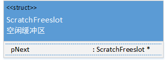

<font face="微软雅黑">

这个文件中用到了全局配置的变量，具体涉及到以下两个结构体：  

  
Sqlite3Config结构体中的变量是sqlite全局的变量，该文件中的初始化函数需要对其中的一些变量赋值或者利用其中的一些变量。这个结构体也定义了后备内存，临时内存和页缓存内存。
```c
struct Sqlite3Config {
  int bMemstat;                         //为真则开启内存状态
  int bCoreMutex;                       //为真，则开启核互斥
  int bFullMutex;                       //为真，则开启全互斥
  int bOpenUri;                         //为真，则将文件名转化为URI
  int mxStrlen;                         //最大字符串长度
  int szLookaside;                      //默认后备缓存大小
  int nLookaside;                       //默认后备缓存数目
  sqlite3_mem_methods m;              //底层内存分配器接口
  sqlite3_mutex_methods mutex;       //底层互斥接口
  sqlite3_pcache_methods2 pcache2;  //底层页缓存接口
  void *pHeap;                          //堆存储空间
  int nHeap;                            //pHeadp[]大小
  int mnReq, mxReq;                    //最小和最大堆请求大小 
  void *pScratch;                      //临时内存
  int szScratch;                       //每个临时缓存的大小 
  int nScratch;                         //临时缓存大数目
  void *pPage;                          //页缓存
  int szPage;                           //每个页缓存的大小
  int nPage;                            //页的数目
  int mxParserStack;                  //解析栈的最大深度
  int sharedCacheEnabled;            //如果共享缓存模式开启了，则为真
  //以上的变量的初始值可为非零值，以下的变量则必须初始化为零
  ** initially be zero, however. 
  int isInit;                           //初始化完成以后置为真
  int inProgress;                      //初始化过程中则为真
  int isMutexInit;                     //互斥锁初始化以后为真
  int isMallocInit;                    //分配初始化以后为真
  int isPCacheInit;                    //分配初始化以后为真
  sqlite3_mutex *pInitMutex;         //初始化函数中使用的锁
  int nRefInitMutex;                   //用户使用的pInitMutex的数量
  void (*xLog)(void*,int,const char*); //记录日志函数
  void *pLogArg;                       //xLog()函数的第一个参数
  int bLocaltimeFault;                //localtime()函数调用失败为真
};
```
Lookaside结构体主要用在与数据库连接对象有关的内存，该种内存可以避免频繁的调用通用的内存分配器，从而提高效率。
```c
struct Lookaside {
  u16 sz;                 	/*每个缓冲区的大小*/
  u8 bEnabled;            /*表示可以进行新的后备内存区的分配。*/
  u8 bMalloced;           /*如果有足够的后备内存区，则为真。 */
  int nOut;               /*当前缓冲区已使用的个数*/
  int mxOut;              /*缓冲区使用过的个数的最大值 */
  int anStat[3];         	/*0：命中，1：部分命中，2：全部没有命中*/
  LookasideSlot *pFree; 	/*可用空闲的缓冲区列表*/
  void *pStart;          		/*可用内存空间的第一个字节 */
  void *pEnd;             	/*可用空间的最后一个字节 */
};
```
本文件中用到两个结构体分别为：  

  
ScratchFreeslot记录每一个空闲的缓冲区位置。  
```c
typedef struct ScratchFreeslot {
  struct ScratchFreeslot *pNext;   /*下一个没有使用的临时缓冲区*/
} ScratchFreeslot;
```
Mem0Global记录了该文件用到的变量包括：内存分配子系统的状态信息等。  
```c
static SQLITE_WSD struct Mem0Global {
  sqlite3_mutex *mutex;         	/*串行访问的变量的锁*/
  sqlite3_int64 alarmThreshold;  	/*申明长整型的变量 预警值*/
//互斥锁的回调函数
  void (*alarmCallback)(void*, sqlite3_int64,int);  
  void *alarmArg;
  void *pScratchEnd; 				/*指向缓冲区的末端*/
  ScratchFreeslot *pScratchFree; /*指向空闲缓冲区*/
//无符号整型 表示连续空闲缓冲区的个数
  u32 nScratchFree; 					
  int nearlyFull; 					/*堆限制的堆内存最大值*/
} mem0 = { 0, 0, 0, 0, 0, 0, 0, 0 };
```

