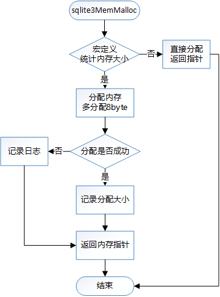

#  缺省内存分配器（mem1.c）
<font face="微软雅黑">

这个文件包含了底层内存分配器，该分配器包含了标准的C函数库，比如`malloc/realloc/free`接口。当既没有定义`SQLITE_MEMDEBUG`，也没有定义`SQLITE_WIN32_MALLOC`时，`SQLITE_WIN32_MALLOC`被自动定义。
文件中包含的预处理宏：
`HAVE_MALLOC_USABLE_SIZE`
`SQLITE_WITHOUT_ZONEMALLOC`
`SQLITE_WITHOUT_MSIZE`
特征：
1. `SQLITE_SYSTEM_MALLOC`;
定义该分配器的宏。
2. 在每个`malloc()`分配的头部，多分配8byte保存分配的大小，以使用`memsize()`返回当前分配的大小；
3. `memsize()`还可跟踪未归还的内存字节数，它能确定当一个分配被释放时，能有多少内存从未归还的内存中移除；
4. 在大多数的应用程序中建议都使用这个缺省的内存分配器。

## 函数介绍

|编号|函数名|功能|
|--|--|--|
|1|static void *sqlite3MemMalloc(int nByte)|分配一块长度为nByte字节的连续区域|
|2|static void sqlite3MemFree(void *pPrior)|释放pPrior指向的存储空间|
|3|static int sqlite3MemSize(void *pPrior)|返回已分配内存的大小|
|4|static void \*sqlite3MemRealloc(void *pPrior, int nByte)|给一个已经分配了地址的指针重新分配空间|
|5|static int sqlite3MemRoundup(int n)|舍入到下一个有效内存分配的大小。|
|6|static int sqlite3MemInit(void *NotUsed)|函数初始化
|7|static void sqlite3MemShutdown(void *NotUsed)|取消函数的初始化
|8|void sqlite3MemSetDefault(void)|底层内存分配函数

## 主要函数介绍
**初始化函数**  
`static int sqlite3MemInit(void *NotUsed)`  
初始化根据不同的平台，采用不同的操作。  

**分配函数**  
`static void *sqlite3MemMalloc(int nByte)`  
该函数根据宏定义决定是否多分配8字节的头部来记录本次分配的大小，分配函数直接调用系统的malloc函数。在返回的时候，返回的指针是指向分配内存头部（记录大小）的下一个字节。执行流程如下：  
  

**释放函数**  
`static void sqlite3MemFree(void *pPrior)`   
根据宏定义的不同，采取不同的释放动作，若定义了宏，则直接释放，否则找到内存空间头部的地址（`p--`），然后在释放，释放函数采用free。  
 
**调整内存大小**  
`static void *sqlite3MemRealloc(void *pPrior, int nByte)`  
若定义了宏，直接利用realloc函数调整，没有定义则利用realloc函数调整，再多分配8byte的头部，最后移动指针，返回调整后内存空间的地址。  

**返回内存大小**  
`static int sqlite3MemSize(void *pPrior)`  
若定义了宏，则直接返回指着所指内存区域的大小，否则，返回内存区域头部的值，即除去头部大小的值。  

## 函数测试
**分配函数**
```
mem1 test
分配内存...
分配内存的大小为:1024
释放内存...
a.out: mem1.c:51: sqlite3MemFree: Assertion `pPrior!=0' failed.
==37156== 
==37156== Process terminating with default action of signal 6 (SIGABRT)
==37156==    at 0x4E6B5F7: raise (in /usr/lib64/libc-2.17.so)
==37156==    by 0x4E6CCE7: abort (in /usr/lib64/libc-2.17.so)
==37156==    by 0x4E64565: __assert_fail_base (in /usr/lib64/libc-2.17.so)
==37156==    by 0x4E64611: __assert_fail (in /usr/lib64/libc-2.17.so)
==37156==    by 0x40073C: sqlite3MemFree (in /home/jipeng/vc6_practice/SQLite/a.out)
==37156==    by 0x4008A8: main (in /home/jipeng/vc6_practice/SQLite/a.out)
==37156== 
==37156== HEAP SUMMARY:
==37156==     in use at exit: 1,032 bytes in 1 blocks
==37156==   total heap usage: 3 allocs, 2 frees, 1,197 bytes allocated
==37156== 
==37156== LEAK SUMMARY:
==37156==    definitely lost: 0 bytes in 0 blocks
==37156==    indirectly lost: 0 bytes in 0 blocks
==37156==      possibly lost: 0 bytes in 0 blocks
==37156==    still reachable: 1,032 bytes in 1 blocks
==37156==                       of which reachable via heuristic:
==37156==                         length64           : 1,032 bytes in 1 blocks
==37156==         suppressed: 0 bytes in 0 blocks
==37156== Rerun with --leak-check=full to see details of leaked memory
==37156== 
==37156== For counts of detected and suppressed errors, rerun with: -v
==37156== ERROR SUMMARY: 0 errors from 0 contexts (suppressed: 0 from 0)
Aborted (core dumped)
```
从上面可以看到分配了供分配了1032字节，其中8字节用于头部，并且内存没有释放，所以发生了内存泄露。  
**释放函数**
```
mem1 test
分配内存...
分配内存的大小为:1024
调整内存...
调整后的内存大小为:2048
==37210== 
==37210== HEAP SUMMARY:
==37210==     in use at exit: 2,056 bytes in 1 blocks
==37210==   total heap usage: 2 allocs, 1 frees, 3,088 bytes allocated
==37210== 
==37210== LEAK SUMMARY:
==37210==    definitely lost: 2,056 bytes in 1 blocks
==37210==    indirectly lost: 0 bytes in 0 blocks
==37210==      possibly lost: 0 bytes in 0 blocks
==37210==    still reachable: 0 bytes in 0 blocks
==37210==         suppressed: 0 bytes in 0 blocks
==37210== Rerun with --leak-check=full to see details of leaked memory
==37210== 
==37210== For counts of detected and suppressed errors, rerun with: -v
==37210== ERROR SUMMARY: 0 errors from 0 contexts (suppressed: 0 from 0)
```
调整为2048，供分配了2056字节，发生了内存泄露。

