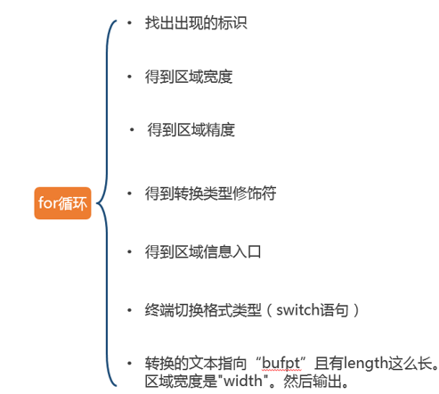
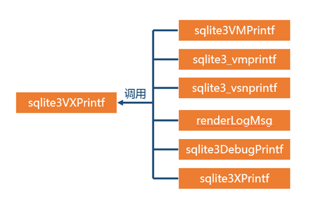

# sqlite3VXPrintf

    void sqlite3VXPrintf(
       StrAccum *pAccum,           /*这里表示累计结果*/
       int useExtended,              /*允许扩展的%-conversions*/
       const char *fmt,              /*格式字符串*/
      va_list ap                    /*参数*/
    )
功能：将fmt给的一个字符串传进StrAccum对象中。

实现方法：格式字符串的for循环。作用分别如下：

实现此功能的一组重要的宏：va_list， va_start， va_arg， va_end。运行流程如下：

（1）首先在函数里定义va_list型的变量，这个变量是指向参数的指针；

（2）然后用va_start宏初始化刚定义的va_list变量；

（3）然后用va_arg返回可变的参数， va_arg的第二个参数是你要返回的参数的类型（如果函数有多个可变参数的，依次调用va_arg获取各个参数）；

（4）最后用va_end宏结束可变参数的获取。

后续的函数分别调用sqlite3VXPrintf实现各自的功能。如下图所示。
 

以下是对函数sqlite3VXPrintf的具体分析。

使用速度寄存器：
register const char *cset;

转换为ascii码：

    do{
     *(--bufpt) = cset[longvalue%base];
     longvalue = longvalue/base;
    }while( longvalue>0 );

添加过的痕迹：

    if( prefix ) *(--bufpt) = prefix;

添加"0" 或 "0x"：

    if( flag_alternateform && infop->prefix ){
          const char *pre;
          char x;
          pre = &aPrefix[infop->prefix];
          for(; (x=(*pre))!=0; pre++) *(--bufpt) = x;
    }

设置默认的精度为6：

    if( precision<0 ) precision = 6;

当使用常数0.4999时进行像BSD一样的凑整：

    for(idx=precision, rounder=0.4999; idx>0; idx--, rounder*=0.1);

使用0.5更有意义：

    for(idx=precision, rounder=0.5; idx>0; idx--, rounder*=0.1){}

使realvalue标准化，即10.0 > realvalue >= 1.0

    if( xtype==etFLOAT ) realvalue += rounder;

如果区域类型是etGENERIC，那么合理地转换为etEXP或etFLOAT：

    if( xtype==etGENERIC ){
          flag_rtz = !flag_alternateform;
          if( exp<-4 || exp>precision ){
            xtype = etEXP;
          }else{
            precision = precision - exp;
            xtype = etFLOAT;
          }
    }

数字前面的前缀符号：

    if( prefix ){
          *(bufpt++) = prefix;
    }

小数点前面的数字：

    if( e2<0 ){
          *(bufpt++) = '0';
        }else{
          for(; e2>=0; e2--){
            *(bufpt++) = et_getdigit(&realvalue,&nsd);
          }
    }

小数点：

    if( flag_dp ){
          *(bufpt++) = '.';
    }

在小数点后且在有效位数前面添加“0”：

    for(e2++; e2<0; precision--, e2++){
          assert( precision>0 );
          *(bufpt++) = '0';
    }

小数点后面的有效数字：

    while( (precision--)>0 ){
          *(bufpt++) = et_getdigit(&realvalue,&nsd);
    }

如果“.”后面没有数字，那么删除尾随零和“.”。

添加后缀"eNNN"：

    *(bufpt++) = (char)((exp/100)+'0');        /*百位数*/
    *(bufpt++) = (char)(exp/10+'0');          /*十位数*/
    *(bufpt++) = (char)(exp%10+'0');         /*个位数*/

被转换的数在数组buf[]中，并且以0结尾，然后输出它。注意，这些数按正常顺序排列，没有改变与整数的转换：
特例：若设置flag_zeropad标识并且没有向左对齐，则添加前导零

%q 和 %Q的精度意味着消耗多少输入字符，而不是输出字符的长度…
if( precision>=0 && precision<length ) length = precision;

转换的文本指向"bufpt"且有length这么长。区域宽度是"width"。然后输出。
