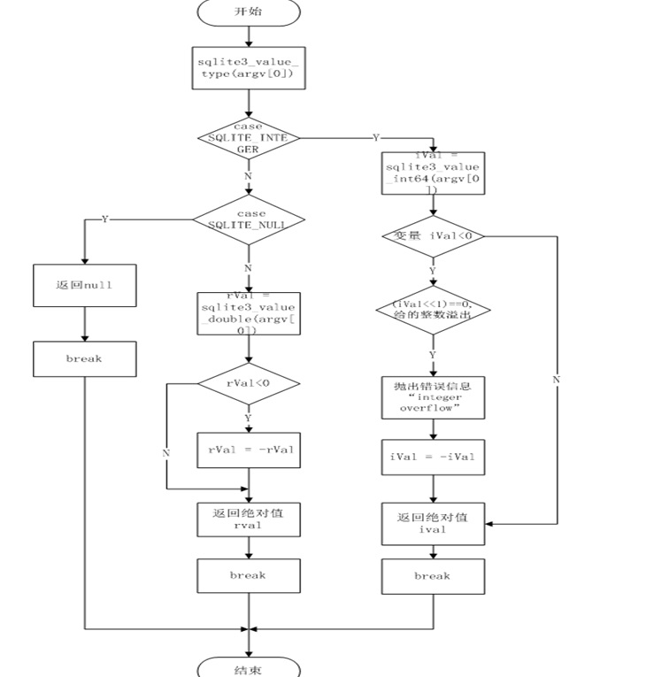

# 算术函数
<font face="微软雅黑" size="3px">

#### 输出最小值最大值`minmaxFunc`  
（1）函数头  
`static void minmaxFunc( sqlite3_context *context, int argc, sqlite3_value **argv)`  
通过变量mask 返回最值  
（2）函数实现流程  
1. 参数argc>1是否保持，判断用户数据的内容是否为0，如果为0，返回最小值0，反之返回最大值-1  
2. 断言最值为-1或0是否保持，判断自定义接口的第一个参数是否为空，如果为空，返回结果  
3. 如果不为空，循环变量，比较参数大小  
4. 返回最值 
   
#### 返回随机整数`randomFunc`  
（1）函数头  
`static void randomFunc(sqlite3_context *context, int NotUsed, sqlite3_value **NotUsed2)`  
SQLite RANDOM 函数返回一个介于 -9223372036854775808 和 +9223372036854775807之间的伪随机整数。  
（2）函数实现流程  
利用随机函数返回随机数，如果随机变量r小于0，为负值，取其绝对值，返回正值即随机数  
#### 返回数值的绝对值`absFunc`  
（1）函数头  
`static void absFunc(sqlite3_context *context, int argc, sqlite3_value **argv)`  
返回数值的绝对值参数X  
（2）函数实现流程  
1. 如果参数argv[0]是`SQLITE_INTEGER`，赋值给变量ival，若ival小于0，对ival取绝对值，返回绝对值ival  
2. 如果参数argv[0]是`SQLITE_NUL`L，返回空  
3. 如果参数argv[0]与上面不匹配，默认赋值给一个双精度度rval，若rval小于0，对rval取绝对值，返回绝对值rval  
如图为absFunc函数实现流程  
 

#### 返回数字表达式并四舍五入为指定的长度或精度`roundFunc`   
（1） 函数头 
```c
static void roundFunc(sqlite3_context *context, /*数字表达式*/
int argc, /*将要四舍五入的精度*/
 sqlite3_value **argv/*要执行的操作的类型*/
)
```
（2）函数实现流程  
1. 判断将要四舍五入的精度的变量r的范围，如精度大于等于0且小于等于后面小数点的位数，则返回四舍五入会的数值，如`round(865.23,1)`865.20  
2. 若变量r小于0且小于等于小数点前的数字个数，则输出四舍五入会的数值 如`round(865.23,-1)`870.00   
3. 若变量r小于0且大于小数点前的数字个数，则返回0，如`round(865.23,-4)`0  