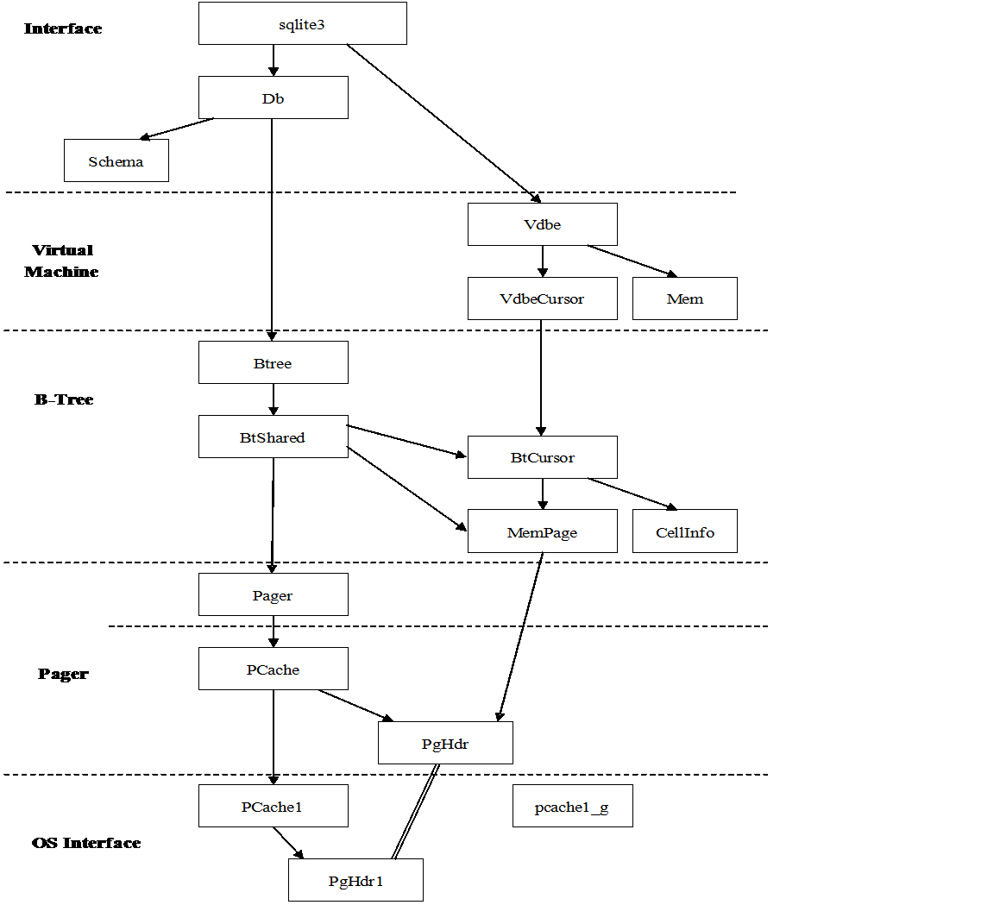

# 存储管理

在今天的商业应用中,主要有两种基本类型的DBMS(数据库管理系统)存储管理器:  
(1)DBMS直接与底层的面向磁盘的块模式设备驱动程序进行交互(通常称为原始模式访问);  
(2)DBMS使用标准的OS文件系统设施.这个决定会在空间和时间上同时影响DBMS控制存储能力.  

SQLite文件存储管理主要由B-树,页缓存(pager)和操作系统接口构成.B-tree的主要功能就是索引,它维护着各个页面之间的复杂的关系,便于快速找到所需数据.而pager的主要作用就是通过OS接口在B-tree和磁盘之间传递页面.

