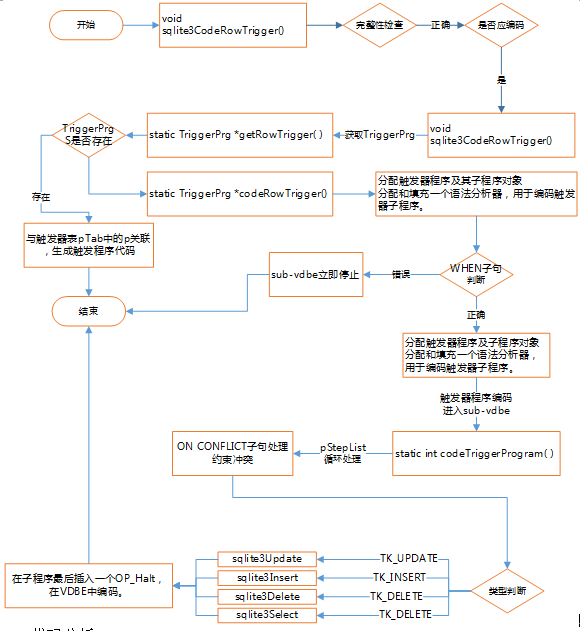

# 触发器编码（Code）

代码分析：

    void sqlite3CodeRowTrigger(
    Parse *pParse,       /* 语法分析器 */
    Trigger *pTrigger,   /* pTab上的触发器列表 */
    int op,              /* TK_UPDATE, TK_INSERT, TK_DELETE中的一个 */
    ExprList *pChanges,  /* 修改列表的任何触发器的UPDATE，如果操作是UPDATE,那么参数pChanges被传递到正在被修改的列表行*/
    int tr_tm,           /* TRIGGER_BEFO RE, TRIGGER_AFTER中的一个 */
    Table *pTab,         /* 编码触发器来自的表*/
    int reg,             /* 寄存器的数组的第一个*/
    int orconf,          /* ON CONFLICT 规则*/
    int ignoreJump       /* 转到RAISE(IGNORE)的指令 */
    ){
    Trigger *p;
    assert(op == TK_UPDATE || op == TK_INSERT || op == TK_DELETE);
    assert(tr_tm == TRIGGER_BEFORE || tr_tm == TRIGGER_AFTER);
    assert((op == TK_UPDATE) == (pChanges != 0));

各种值不为空。
触发器和表的模式总是被定义的。
触发器必须和表在相同的模式,否则必须是临时触发器。

    for (p = pTrigger; p; p = p->pNext){
    assert(p->pSchema != 0);
    assert(p->pTabSchema != 0);
    assert(p->pSchema == p->pTabSchema|| p->pSchema == pParse->db->aDb[1].pSchema);
    if (p->op == op&& p->tr_tm == tr_tm&& checkColumnOverlap(p->pColumns, pChanges)
    ){
    sqlite3CodeRowTriggerDirect(pParse, p, pTab, reg, orconf, ignoreJump);
    }
    }
    }
&nbsp;

    void sqlite3CodeRowTriggerDirect(
    ……
    ){
    Vdbe *v = sqlite3GetVdbe(pParse); /* Main VM 主虚拟存贮器 */
    TriggerPrg *pPrg;
    pPrg = getRowTrigger(pParse, p, pTab, orconf);

判断

    assert(pPrg || pParse->nErr || pParse->db->mallocFailed);
    if (pPrg){
		int bRecursive = (p->zName && 0 == (pParse->db->flags&SQLITE_RecTriggers));
		sqlite3VdbeAddOp3(v, OP_Program, reg, ignoreJump, ++pParse->nMem);
		sqlite3VdbeChangeP4(v, -1, (const char *)pPrg->pProgram, P4_SUBPROGRAM);
		VdbeComment((v, "Call: %s.%s", (p->zName ? p->zName : "fkey"), onErrorText(orconf)));

在VDBE对Trigger语句进行编码

		sqlite3VdbeChangeP5(v, (u8)bRecursive);
    }
    }
&nbsp;

    static TriggerPrg *getRowTrigger(
    ……){
    Parse *pRoot = sqlite3ParseToplevel(pParse);
    TriggerPrg *pPrg;
    assert(pTrigger->zName == 0 || pTab == tableOfTrigger(pTrigger));

也许这个触发器已经被编码(或在被编码过程中),找到他。

	for (pPrg = pRoot->pTriggerPrg;pPrg && (pPrg->pTrigger != pTrigger || pPrg->orconf != orconf);pPrg = pPrg->pNext);

没有则创建新的

	if (!pPrg){
    pPrg = codeRowTrigger(pParse, pTrigger, pTab, orconf);
    }
    return pPrg;
    }

&nbsp;

    static TriggerPrg *codeRowTrigger(……){
    ……
    TriggerPrg *pPrg;

构建TriggerPrg及其子程序对象

    pPrg = sqlite3DbMallocZero(db, sizeof(TriggerPrg));
    if (!pPrg) return 0;
    pPrg->pNext = pTop->pTriggerPrg;
    pTop->pTriggerPrg = pPrg;
    pPrg->pProgram = pProgram = sqlite3DbMallocZero(db, sizeof(SubProgram));
    if (!pProgram) return 0;

为了确保出错时，他们被释放，必须尽早将他们链接到顶级解析对象Parse.pTriggerPrg列表。

    sqlite3VdbeLinkSubProgram(pTop->pVdbe, pProgram);
    pPrg->pTrigger = pTrigger;
    pPrg->orconf = orconf;
    pPrg->aColmask[0] = 0xffffffff;
    pPrg->aColmask[1] = 0xffffffff;
    ……

构建一个语法分析器，用于编码触发器子程序。

    Parse *pSubParse;
    pSubParse = sqlite3StackAllocZero(db, sizeof(Parse));
    if (!pSubParse) return 0;
    memset(&sNC, 0, sizeof(sNC));
    sNC.pParse = pSubParse;
    pSubParse->db = db;
    pSubParse->pTriggerTab = pTab;
    pSubParse->pToplevel = pTop;
    pSubParse->zAuthContext = pTrigger->zName;
    pSubParse->eTriggerOp = pTrigger->op;
    pSubParse->nQueryLoop = pParse->nQueryLoop;
    v = sqlite3GetVdbe(pSubParse);
    if (v){
	VdbeComment((v, “Start: %s.%s (%s %s%s%s ON %s)”, /* 输出错误信息*/
	pTrigger->zName, onErrorText(orconf),
	(pTrigger->tr_tm == TRIGGER_BEFORE ? "BEFORE" : "AFTER"),
	(pTrigger->op == TK_UPDATE ? "UPDATE" : ""),
	(pTrigger->op == TK_INSERT ? "INSERT" : ""),
	(pTrigger->op == TK_DELETE ? "DELETE" : ""),
	pTab->zName
	));
    ……

如果代码WHEN子句被指定，它的求值结果为false(或NULL)，则sub-vdbe立即停止

    if (pTrigger->pWhen){
    pWhen = sqlite3ExprDup(db, pTrigger->pWhen, 0);
    if (SQLITE_OK == sqlite3ResolveExprNames(&sNC, pWhen)
    && db->mallocFailed == 0
    ){
	iEndTrigger = sqlite3VdbeMakeLabel(v);
	sqlite3ExprIfFalse(pSubParse, pWhen, iEndTrigger,    SQLITE_JUMPIFNULL);
    }
	sqlite3ExprDelete(db, pWhen);
    }

触发器程序编码进入sub-vdbe

    codeTriggerProgram(pSubParse, pTrigger->step_list, orconf);
    if (iEndTrigger){
    sqlite3VdbeResolveLabel(v, iEndTrigger);
    }
    sqlite3VdbeAddOp0(v, OP_Halt);

子程序最后加入停止命令

    VdbeComment((v, "End: %s.%s", pTrigger->zName, onErrorText(orconf)));
    transferParseError(pParse, pSubParse);
    if (db->mallocFailed == 0){
    pProgram->aOp = sqlite3VdbeTakeOpArray(v, &pProgram->nOp, &pTop->nMaxArg);
    }
    ……}……

返回构建的Trigger

    return pPrg;
    }

&nbsp;

    static int codeTriggerProgram(……){
    TriggerStep *pStep;
    Vdbe *v = pParse->pVdbe;
    sqlite3 *db = pParse->db;
    assert(pParse->pTriggerTab && pParse->pToplevel);
    assert(pStepList);
    assert(v != 0);

对每一步进行循环

    for (pStep = pStepList; pStep; pStep = pStep->pNext){

计算出需要在触发器子进程中使用的ON CONFLICT规则

    	pParse->eOrconf = (orconf == OE_Default) ? pStep->orconf : (u8)orconf;
    	……
    }

    static int codeTriggerProgram(……){
    ……
    switch (pStep->op){
    case TK_UPDATE: {
    	sqlite3Update(pParse,targetSrcList(pParse, pStep),sqlite3ExprListDup(db, pStep->pExprList, 0),
    	sqlite3ExprDup(db, pStep->pWhere, 0),pParse->eOrconf);
    break;}
    case TK_INSERT: {
    	sqlite3Insert(pParse,targetSrcList(pParse, pStep),sqlite3ExprListDup(db, pStep->pExprList, 0),sqlite3SelectDup(db, pStep->pSelect, 0),
    	sqlite3IdListDup(db, pStep->pIdList),pParse->eOrconf);
    break;}
    case TK_DELETE: {
    sqlite3DeleteFrom(pParse,targetSrcList(pParse, pStep),sqlite3ExprDup(db, pStep->pWhere, 0));
    break;}

根据pStep->op的值进行判断，分别进行UPDATE、INSERT、DELETE和SELECT操作

    default: assert(pStep->op == TK_SELECT); {
     SelectDest sDest;
     Select *pSelect = sqlite3SelectDup(db, pStep->pSelect, 0);
     sqlite3SelectDestInit(&sDest, SRT_Discard, 0);
     sqlite3Select(pParse, pSelect, &sDest);
     sqlite3SelectDelete(db, pSelect);
     break;}}
    if (pStep->op != TK_SELECT){
    sqlite3VdbeAddOp0(v, OP_ResetCount);
    }
    }
    return 0;
    }

