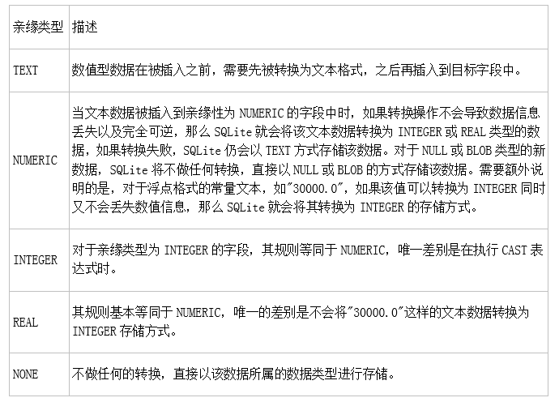

# sqlite3ColumnDefault函数结构

    void sqlite3ColumnDefault(Vdbe *v, Table *pTab, int i, int iReg){  //该函数用来更新列的默认值
    assert( pTab!=0 );
    **ASSERT()是一个调试程序时经常使用的宏，在程序运行时它计算括号内的表达式，
    **如果表达式为FALSE  (0),  程序将报告错误，并终止执行。如果表达式不为0，则继续执行后面的语句。
    **这个宏通常原来判断程序中是否出现了明显非法的数据，如果出现了终止程序以免导致严重后果，
    **同时也便于查找错误。
    **这里就是虚拟表建立成功后执行下面的语句
    if( !pTab->pSelect ){
     //表pTab的select语句,如果该表为基本表,则为空,如果该表为视图,则存放视图定义
    sqlite3_value *pValue;
     //定义一个sqlite3_value类型的指针
    u8 enc = ENC(sqlite3VdbeDb(v));
     //返回数据库v的模式定义,并传给变量enc
    Column *pCol = &pTab->aCol[i];
     //Column是一个结构体不是一个函数,将表pTab的第i列传给变量pCol
    VdbeComment((v, "%s.%s", pTab->zName, pCol->zName));
    //v代表数据库v,pTab->zName表示表pTab表名,pCol->zName表示pTab表中第i列的列名
    assert( i<pTab->nCol );
     //验证i是否小于表pTab的总列数
    sqlite3ValueFromExpr(sqlite3VdbeDb(v), pCol->pDflt, enc,
                         pCol->affinity, &pValue);
    //根据pCol->pDflt语句计算出新的列默认值,该默认值保存在pValue中
    //pCol->affinity表示与列pCol相关的关系
    if( pValue ){
      sqlite3VdbeChangeP4(v, -1, (const char *)pValue, P4_MEM);
    }
     //将列的默认值更新为新的默认值pValue
    #ifndef SQLITE_OMIT_FLOATING_POINT
    if( iReg>=0 && pTab->aCol[i].affinity==SQLITE_AFF_REAL ){
      sqlite3VdbeAddOp1(v, OP_RealAffinity, iReg);  //数据库v增加新的约束,即列的新默认值
    }
    #endif
    }
    }
    列没有类型或域的概念.虽然可以定义列类型,但在内部实现中采用了类型亲缘性.类型亲缘性决定了SQLite存储列值的存储类。列亲缘性可以分为四类:数值、整数、文本以及空
一、存储种类和数据类型：
    SQLite将数据值的存储划分为以下几种存储类型：

     NULL: 表示该值为NULL值。
     INTEGER: 无符号整型值。
     REAL: 浮点值。
     TEXT: 文本字符串，存储使用的编码方式为UTF-8、UTF-16BE、UTF-16LE。
     BLOB: 存储Blob数据，该类型数据和输入数据完全相同。
&nbsp;&nbsp;&nbsp;&nbsp;&nbsp;&nbsp;&nbsp;&nbsp;由于SQLite采用的是动态数据类型，而其他传统的关系型数据库使用的是静态数据类型，即字段可以存储的数据类型是在表声明时即以确定的，因此它们之间在数据存储方面还是存在着很大的差异。在SQLite中，存储分类和数据类型也有一定的差别，如INTEGER存储类别可以包含6种不同长度的Integer数据类型，然而这些INTEGER数据一旦被读入到内存后，SQLite会将其全部视为占用8个字节无符号整型。因此对于SQLite而言，即使在表声明中明确了字段类型，我们仍然可以在该字段中存储其它类型的数据。然而需要特别说明的是，尽管SQLite为我们提供了这种方便，但是一旦考虑到数据库平台的可移植性问题，我们在实际的开发中还是应该尽可能的保证数据类型的存储和声明的一致性。除非你有极为充分的理由，同时又不再考虑数据库平台的移植问题，在此种情况下确实可以使用SQLite提供的此种特征。
    1. 布尔数据类型：
    SQLite并没有提供专门的布尔存储类型，取而代之的是存储整型1表示true，0表示false。
    2. 日期和时间数据类型：
    和布尔类型一样，SQLite也同样没有提供专门的日期时间存储类型，而是以TEXT、REAL和INTEGER类型分别不同的格式表示该类型，如：
    TEXT: "YYYY-MM-DD HH:MM:SS.SSS"
    REAL: 以Julian日期格式存储
    INTEGER: 以Unix时间形式保存数据值，即从1970-01-01 00:00:00到当前时间所流经的秒数。

二、类型亲缘性：

&nbsp;&nbsp;&nbsp;&nbsp;&nbsp;&nbsp;&nbsp;&nbsp;为了最大化SQLite和其它数据库引擎之间的数据类型兼容性，SQLite提出了"类型亲缘性(Type Affinity)"的概念。我们可以这样理解"类型亲缘性 "，在表字段被声明之后，SQLite都会根据该字段声明时的类型为其选择一种亲缘类型，当数据插入时，该字段的数据将会优先采用亲缘类型作为该值的存储方式，除非亲缘类型不匹配或无法转换当前数据到该亲缘类型，这样SQLite才会考虑其它更适合该值的类型存储该值。SQLite目前的版本支持以下五种亲缘类型：

    1. 决定字段亲缘性的规则：
    字段的亲缘性是根据该字段在声明时被定义的类型来决定的，具体的规则可以参照以下列表。需要注意的是以下列表的顺序，即如果某一字段类型同时符合两种亲缘性，那么排在前面的规则将先产生作用。
    1). 如果类型字符串中包含"INT"，那么该字段的亲缘类型是INTEGER。
    2). 如果类型字符串中包含"CHAR"、"CLOB"或"TEXT"，那么该字段的亲缘类型是TEXT，如VARCHAR。
    3). 如果类型字符串中包含"BLOB"，那么该字段的亲缘类型是NONE。
    4). 如果类型字符串中包含"REAL"、"FLOA"或"DOUB"，那么该字段的亲缘类型是REAL。
    5). 其余情况下，字段的亲缘类型为NUMERIC。
       注：在SQLite中，类型VARCHAR(255)的长度信息255没有任何实际意义，仅仅是为了保证与其它数据库的声明一致性。
